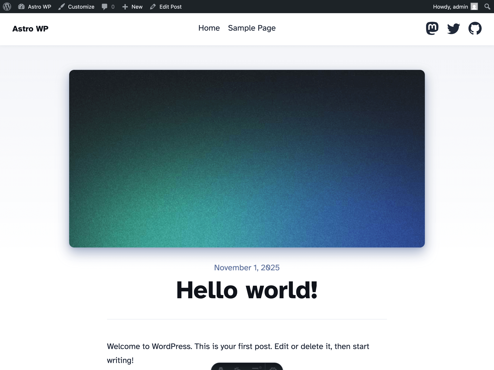

# 🚀 Astro WordPress Starter

This project is based on the **[Astro Blog Template](https://github.com/withastro/astro/tree/main/examples/blog)**.



---

## Local Development Setup

### 1. Start WordPress with Docker

```bash
docker compose up
```

Once the containers are running, open [http://localhost:8088](http://localhost:8088) and follow the instructions to install **WordPress**.

---

### 2. Install Dependencies

```bash
npm install
```

---

### 3. Run Astro in Development Mode

```bash
npm run dev
```

---

### 4. Activate the WordPress Theme

In your [WordPress admin dashboard](http://localhost:8088/wp-admin):

> **Appearance → Themes → Activate "Astro WordPress Starter"**

---

### 5. View Your Site

Open [http://localhost:4321](http://localhost:4321).

---

## Build for Production

To export your theme, follow the instructions here:
[**astro-wordpress — Build for Production**](https://github.com/sijad/astro-wordpress#build-for-production)

---
